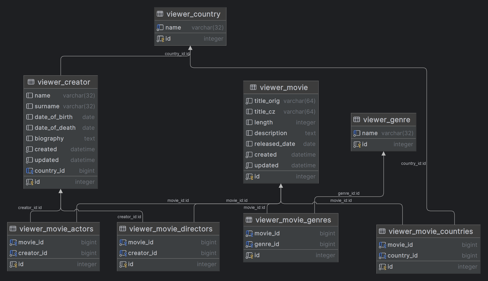

# Projekt HollyMovies

## Django
### Instalace
```bash
pip install django
```
```bash
pip freeze > requirements.txt
```

### Vytvoření projektu
```bash
django-admin startproject <nazev_projektu> .
```

## .env soubor
```bash
pip install python-dotenv
```
Vytvořím soubor `.env` v kořenovém adresáři projektu,
vložím do tohoto souboru `SECRET_KEY`, ale bez mezer a uvozovek.

Do souboru `settings.py` importujeme modul `dotenv`:
```python
from dotenv import load_dotenv
load_dotenv()
SECRET_KEY = os.getenv('SECRET_KEY', default='django-insecure-)si+fpno3#)=7__vx-4%ni^&n1wvaz9bju1e+s8*i!e9qt!@f)')
```

### Vytvoření aplikace 
```bash
python manage.py startapp <nazev_aplikace>
```

> [!WARNING]
> Nesmíme zapomenout zaregistrovat aplikaci do souboru `settings.py`:
> ```python
> INSTALLED_APPS = [
>     'django.contrib.admin',
>     'django.contrib.auth',
>     'django.contrib.contenttypes',
>     'django.contrib.sessions',
>     'django.contrib.messages',
>     'django.contrib.staticfiles',
>     
>     'viewer',
> ]
> ```

### Vytvoření databáze
```bash
python manage.py migrate
```

### Vytvoření superuser účtu
```bash
python manage.py createsuperuser
```

## Popis projektu
Filmová databáze.

## Funkcionalita
- [ ] 1 Zobrazení seznamu filmů
- [ ] 2 Zobrazení detailu filmu
- [ ] 3 Práce s filmem v databázi
  - [ ] 3.1 přidání filmu
  - [ ] 3.2 editace filmu
  - [ ] 3.3 mazání filmu

## Databáze



- [x] Genre
  - [x] name (String)

- [x] Country
  - [x] name (String) 

- [ ] Creator
  - [x] name (String)
  - [x] surname (String)
  - [x] country (FK -> Country)
  - [x] date_of_birth (Date)
  - [x] date_of_death (Date)
  - [x] biography (String)
  - [ ] images (FK -> Image)

- [ ] Movie
  - [x] title_orig (String)
  - [x] title_cz (String)
  - [x] genres (n:m -> Genre)
  - [x] countries (n:m -> Country)
  - [x] length (Integer)
  - [x] directors (n:m -> Creator)
  - [x] actors (n:m -> Creator)
  - [x] description (String)
  - [x] released_date (Date)
  - [ ] images (FK -> Image)